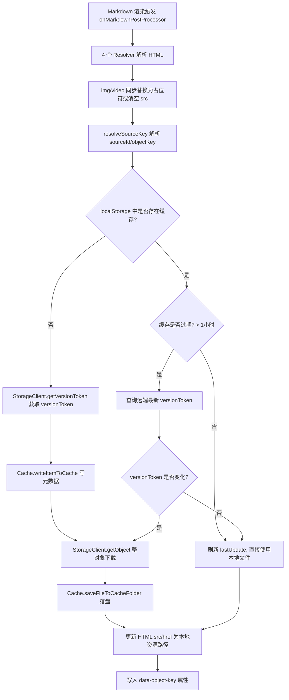
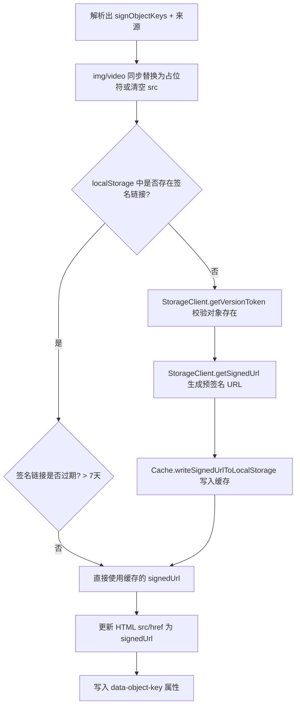
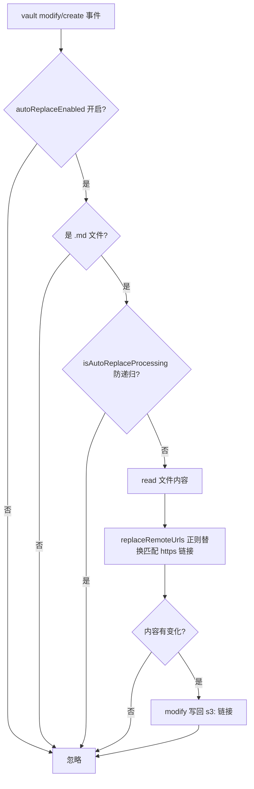
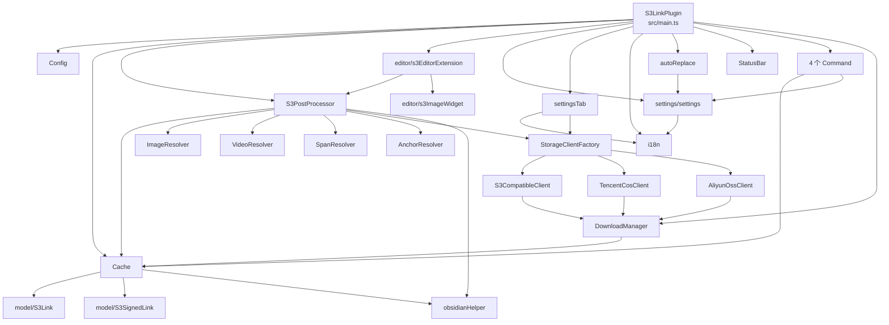

# obsidian-plugin-s3-link 架构文档

> 最后更新：2026-09-01
> 本文档基于对代码库的静态扫描自动生成，并随多对象存储支持、UI 增强、自动替换、COS 浏览器 SDK 调整、日志级别设置、s3: 链接占位符修复、移动端兼容改造与编辑器（Live Preview）支持同步更新。

## 1. 项目概览

`obsidian-plugin-s3-link` 是一个 Obsidian 插件（桌面端 + 移动端，见 `decisions/2026-09-01-mobile-support.md`；移动端兼容已实现、待真机验证），用于在笔记中引用对象存储中的文件。插件会把文件下载并缓存到本地 vault 的 `s3_cache` 文件夹，并支持生成预签名 URL。

- **已实现**：AWS S3、腾讯云 COS、阿里云 OSS、任意 S3 兼容端点（MinIO 等）
- **认证**：设置页文本输入 Access Key / Secret Key（不再读取 `~/.aws/credentials`）
- **UI**：Provider 下拉；已知服务商端点按 Region 自动组合；测试连接；中/英文界面
- **日志**：日志级别设置（DEBUG / INFO / WARN / ERROR / NONE，默认 INFO）
- **自动替换**：可选监听文档变化，将匹配存储源的 `https://` 链接自动替换为 `s3:` 格式
- **编辑器**：阅读视图（preview）与编辑视图（Live Preview）均可渲染 `s3:` 图片（CodeMirror 6 扩展）
- **平台**：不再依赖 Node 内置模块，桌面端与移动端（Capacitor WebView）均可运行
- **当前版本**：1.2.0（含编辑视图 Live Preview 支持、移动端兼容改造与 s3: 占位符守卫）

支持的链接语法：

| 语法 | 行为 |
| --- | --- |
| `s3:[objectKey]` | 下载并缓存文件到本地，周期性检查远端是否有新版本 |
| `s3:[sourceName/objectKey]` | 指定存储源（多源场景，可选前缀） |
| `s3-sign:[objectKey]` / `s3-sign:[sourceName/objectKey]` | 生成预签名 URL（7 天有效，自动续签） |

支持的 HTML 元素：图片 `img`、视频 `video`、内嵌 span（PDF/音频）、锚点 `a`。

## 2. 技术栈

- **语言**：TypeScript
- **构建工具**：esbuild（CJS，`src/main.ts` → `main.js`）
- **测试框架**：Jest + jsdom（`test/mock/obsidianMock.ts`）
- **CI/CD**：GitHub Actions
- **包管理器**：pnpm
- **关键依赖**：
  - Obsidian API：`Plugin`、`PluginSettingTab`、`Notice`、`TFile`、`TAbstractFile`、`FileSystemAdapter`、`Vault`
  - 编辑器：`@codemirror/view` / `@codemirror/state`（esbuild external，运行时由 Obsidian 提供）
  - 存储 SDK：`cos-js-sdk-v5`（腾讯云 COS，浏览器版）；AWS S3 / S3 兼容与阿里云 OSS 使用原生 `fetch` + 手写签名（Web Crypto），不再依赖第三方 SDK
- **AI 辅助**：DeepSeek V4（通过 Copilot Chat）+ ArcMesh 知识管理

> Obsidian 插件运行于渲染进程（浏览器环境），COS 使用浏览器 SDK `cos-js-sdk-v5`；S3 / S3 兼容与 OSS 的签名由 `crypto.subtle` 实现（桌面与移动端均可），哈希用于缓存文件名。

## 3. 目录结构

```
src/
├── main.ts                  # 插件入口（设置迁移、语言、vault 监听/自动替换、编辑器扩展注册）
├── config.ts                # 全局常量（前缀、PROVIDERS、占位符、缓存模式版本等）
├── i18n.ts                  # 多语言（en/zh），setLanguage / t(key)
├── logger.ts                # 统一日志（LogLevel 过滤，默认 INFO）
├── platformUtil.ts          # 平台工具（Web Crypto 哈希/HMAC、Base64、路径、字节流收集）
├── placeholderGuard.ts      # 全局占位符守卫（MutationObserver 拦截 s3: src）
├── autoReplace.ts           # https:// → s3: 链接自动替换（正则 + 围栏感知）
├── cache.ts                 # 本地缓存（Vault 二进制写盘 + localStorage 元数据）
├── s3PostProcessor.ts       # Markdown 后处理器（多源编排核心；含编辑器共享 resolveLinkResourceUrl）
├── obsidianHelper.ts        # 资源路径辅助（getCacheFileName sha1、getVaultResourcePath）
├── pluginState.ts           # 插件状态枚举
├── editor/                  # CodeMirror 6 编辑器扩展（Live Preview 内联渲染 s3: 图片）
├── command/                 # 4 个命令（清缓存/重载叶子）
├── model/                   # S3Link（versionToken/sourceId）、S3SignedLink
├── network/                 # StorageClient + 3 适配器 + 工厂 + DownloadManager + sigV4 + ossSigner
├── resolver/                # img/video/span/anchor 四类解析器
├── settings/                # StorageSource 模型 + settingsTab
└── ui/                      # notification、statusBar
```

> `src/aws/` 目录已下线。

## 4. 核心模块说明

### 4.1 入口：`S3LinkPlugin`（`src/main.ts`）

- `onload`：状态栏 → 加载设置（含迁移）→ 应用日志级别（`Logger`）→ 设置页 → `Cache` → 清理下载 → 后处理器 → 编辑器扩展 → 命令 → `registerVaultListeners` → 状态。
- `registerVaultListeners`：`vault.on("modify"/"create")` → `onFileModified`（`autoReplaceEnabled` 开启时对 `.md` 重写 `https://` → `s3:`；`isAutoReplaceProcessing` 防递归）。
- `setupMarkdownPostProcessor`：创建 `S3PostProcessor` 后同时注册 `registerMarkdownPostProcessor`（阅读视图）与 `registerEditorExtension(s3EditorExtension(() => this.s3PostProcessor))`（编辑视图，getter 延迟取用）。

### 4.2 配置常量：`Config`（`src/config.ts`）

`CACHE_FOLDER`、`S3_LINK_PREFIX`(`s3`)、`S3_SIGNED_LINK_PREFIX`(`s3-sign`)、`SOURCE_SPLITTER`(`/`)、TTL 常量、`CACHE_SCHEMA_VERSION`(2)、`PROVIDERS`、`S3_LINK_PLACEHOLDER`（透明 GIF data URI，见 §4.4）。

### 4.3 编排核心：`S3PostProcessor`（`src/s3PostProcessor.ts`）

4 个 Resolver → `resolveSourceKey` → `clients` Map → `StorageClient` 处理；统一 `versionToken`。新增 `resolveLinkResourceUrl(rawKey)`：编辑器共享的按需解析入口（缓存命中直读，未命中下载后返回资源路径；`s3-sign:` 走签名缓存或重新生成）。

### 4.4 解析器族：`Resolver`（`src/resolver/`）

`img` / `video` / `span` / `a`；`split(":")` 解析（含冒号截断局限）。

> **s3: 占位符修复（2026-09-01，v1.0.10）**：`s3:` 不是 Electron 渲染进程注册的 scheme，Obsidian 渲染器会直接生成 ``，浏览器在后处理器异步下载完成前就尝试加载未知 scheme，控制台报 `net::ERR_UNKNOWN_URL_SCHEME`。修复方式：
> - `ImageResolver` 命中 `s3:` / `s3-sign:` 的 `img` 时，在任何 `await` 之前**同步**把 `src` 替换为 `Config.S3_LINK_PLACEHOLDER`（透明 GIF data URI），待后处理器取到本地文件或签名 URL 后再写回真实 `src`；
> - `VideoResolver` 对命中 `video` 同步 `removeAttribute("src")`，同样由后处理器回填；
> - `span` / `anchor` 不需要处理——非媒体元素不会自动加载 `src`/`href`。
>
> **全局占位符守卫（2026-09-01）**：post-processor 的同步替换仍可能被 Obsidian（live-preview 等）在渲染管线中绕过，导致 `src` 再次变为 `s3:`。新增 `src/placeholderGuard.ts`：全局 MutationObserver 在插件 onload 最早期注册（早于 Obsidian 渲染视图），监听 `document.body` 的 `src` 属性变化与新增元素（childList），一旦出现 `s3:` / `s3-sign:` 前缀立即替换为占位符（img）或移除 `src`（video）。observer 回调运行在浏览器实际加载之前，可阻止 ERR。由 `main.ts` 持有、onunload 断开。

### 4.5 缓存：`Cache`（`src/cache.ts`）

vault 相对路径 `s3_cache/`（`sha1(versionToken)+ext`）+ localStorage（含 sourceId 键）；`CACHE_SCHEMA_VERSION` 升级自动清缓存。文件通过 Obsidian Vault 二进制 API（`createBinary` / `modifyBinary`）写盘，写入即进入 vault 索引（桌面与移动端均可解析资源路径）；下载内容整对象缓冲（无流式）。

### 4.6 网络层：`StorageClient` 适配器体系（`src/network/`）

```ts
interface StorageClient {
    getVersionToken(objectKey: string): Promise<string | undefined>;
    getObject(objectKey: string, versionToken: string): Promise<Uint8Array>;
    getSignedUrl(objectKey: string): Promise<string>;
    testConnection(): Promise<void>;
}
```

| 适配器 | 依赖 | 版本标识 | 签名 URL | 测试连接 | 备注 |
| --- | --- | --- | --- | --- | --- |
| `S3CompatibleClient` | 原生 `fetch` + SigV4（Web Crypto） | `x-amz-version-id` / `ETag` | 预签名（SigV4 query） | ListObjectsV2（fetch） | endpoint/pathStyle，无第三方 SDK |
| `TencentCosClient` | `cos-js-sdk-v5`（浏览器） | headObject `ETag` | `cos.getObjectUrl` | `cos.getBucket` | 下载整对象缓冲 |
| `AliyunOssClient` | 原生 `fetch` + OSS 签名（Web Crypto） | head `etag` | `signOssUrl` | GET /bucket | 自动组合端点，无第三方 SDK |

`StorageClientFactory.create(source)` 按 provider 分发；`DownloadManager` 管理下载状态机（`PENDING → RUNNING → COMPLETED / FAILED`）。

### 4.7 AWS 凭证（已下线）

### 4.8 命令（`src/command/`）

`ClearCacheGlobal` / `ClearCacheLocal`（多源解析）/ `ReloadActiveLeaf` / `ReloadAllLeafs`。

### 4.9 设置（`src/settings/`）

- `StorageSource` + `PluginSettings{sources, language, autoReplaceEnabled, logLevel}`。
- `getComposedEndpoint` / `isKnownProvider` / `resolveSourceKey` / `isPluginReadyState`。
- `PluginSettingsTab`：语言下拉、日志级别下拉、自动替换开关、Provider 下拉、已知服务商端点自动组合、S3 兼容自定义端点、测试连接、添加/删除源。

### 4.10 UI（`src/ui/`）

`sendNotification`（Notice）、`StatusBar`。

### 4.11 日志与辅助

`logger.ts`（`Logger` + `LogLevel`：DEBUG / INFO / WARN / ERROR / NONE，默认 INFO；所有插件日志统一经 `Logger` 按级别过滤，设置页「日志级别」下拉控制）、`obsidianHelper.ts`（`getCacheFileName` 异步 sha1、`getVaultResourcePath` 优先 vault 索引/资源路径、`getCacheFileUrl` 桌面 `file://` / 移动端 vault 路径）、`i18n.ts`。

### 4.12 自动替换远程链接（`src/autoReplace.ts`）

- 各源主机后缀规则（COS `cos.<region>.myqcloud.com`；OSS `oss-<region>.aliyuncs.com`/`oss.aliyuncs.com`；AWS `s3.*.amazonaws.com`；S3 兼容端点主机名）
- `replaceRemoteUrls`：正则匹配 `https?://`，虚拟主机/路径寻址，桶名匹配后替换为 `s3:<sourceName/objectKey>`（默认源无前缀）；fenced 代码块不处理。

### 4.13 编辑器扩展（`src/editor/`，2026-09-01）

阅读视图靠 `registerMarkdownPostProcessor`，但 Live Preview（编辑器）用 CodeMirror 6 渲染，不会运行 post processor，`s3:` 非标准 scheme 也不被 Obsidian 原生图片扩展识别 → 编辑视图看不到图片。新增 CodeMirror 6 扩展：

- `s3EditorExtension.ts`：`ViewPlugin.fromClass` 构建 `DecorationSet`；正则匹配 `` / `![[s3:...]]` / `![[s3-sign:...]]`（含 wiki 嵌入），`Decoration.replace({ widget, block:false })` 替换为内联 ``；光标位于链接范围内时跳过替换（保持可编辑）；doc / selection / viewport 变化时重建 decorations。
- `s3ImageWidget.ts`：widget 的 `` 以 `Config.S3_LINK_PLACEHOLDER` 起步（避免 `s3:` 直接进入 `src`），异步调用 `S3PostProcessor.resolveLinkResourceUrl(schemeKey)` 解析真实资源路径后写回 `src`；`eq` 按 rawKey 复用、避免重复重建。
- `S3EditorLinkResolver`：对同一 key 去重（in-flight 共享 + 结果记忆化），防止选区每次移动都触发重复下载/解析。
- 注册：`main.ts` 经 `registerEditorExtension(s3EditorExtension(() => this.s3PostProcessor))`，getter 延迟取用后处理器实例，设置重建后自动生效。
- `@codemirror/view` / `@codemirror/state` 在 esbuild 中保持 external，运行时由 Obsidian 提供。

## 5. 核心流程

### 5.1 普通链接 `s3:` 处理流程



### 5.2 签名链接 `s3-sign:` 处理流程



### 5.3 自动替换流程



### 5.4 编辑视图（Live Preview）渲染流程

```mermaid
flowchart TD
    A[CodeMirror ViewPlugin 触发] --> B[正则匹配  / ![[s3:...]]]
    B --> C{光标在链接内?}
    C -- 是 --> D[跳过, 保留可编辑文本]
    C -- 否 --> E[Decoration.replace 换成内联 img widget 占位符]
    E --> F[异步 resolveLinkResourceUrl 解析]
    F --> G{缓存命中且文件存在?}
    G -- 是 --> H[返回本地资源路径]
    G -- 否 --> I[按需下载到缓存]
    I --> H
    H --> J[写回 img.src]
```

## 6. 数据存储汇总

| 存储位置 | 内容 | 键/路径格式 |
| --- | --- | --- |
| localStorage | 普通链接元数据 | `obsidian-plugin-s3-link/<sourceId>/<objectKey>` |
| localStorage | 签名链接元数据 | `obsidian-plugin-s3-link/<sourceId>/s3-sign/<objectKey>` |
| localStorage | 下载记录 | `obsidian-plugin-s3-link-manager/<sourceId>/<objectKey>/<versionToken>` |
| localStorage | 缓存模式版本 | `obsidian-plugin-s3-link-cache-schema-version` = `2` |
| 文件系统 | 缓存文件 | `<vault>/s3_cache/<sha1(versionToken)><extname>` |
| 文件系统 | 插件设置 | Obsidian `data.json`（`sources` + `language` + `autoReplaceEnabled`） |

## 7. 依赖关系图



## 8. 构建、测试与发布

- 本地仅开发 `npm run dev`（监听构建）。Lint（ESLint）、测试（Jest 12 套件 / 88 用例，含 platformUtil / sigV4 / ossSigner 签名测试）与生产构建（tsc + esbuild，`main.js` 约 0.57MB）由 GitHub Actions `.github/workflows/ci.yaml` 在 push / PR 时执行。
- 发布：推送 `v*` 标签触发 GitHub Actions（`.github/workflows/release.yaml`）创建 Release（main.js / manifest.json / versions.json）。

## 9. 设计要点与已知局限

1. 多源 + 版本令牌；适配器隔离；端点自动组合；崩溃恢复（`CACHE_SCHEMA_VERSION` / `DownloadManager` 清理）。
2. **移动端兼容改造（2026-09-01）**：移除全部 Node 内置依赖（`fs`/`path`/`stream`/`crypto`），缓存走 Vault 二进制 API、签名走 Web Crypto（`sigV4.ts` / `ossSigner.ts`）、COS 保留浏览器 SDK。签名已与官方 `@smithy/signature-v4` 逐字节对照验证；**待真机验证**：真实桶端到端、移动端 iOS/Android 渲染。
3. **整对象缓冲**：所有适配器下载均为整对象缓冲（移动端 Vault API 无法流式写盘），超大文件内存占用需注意（原桌面端流式写盘已移除）。
4. **自动替换局限**：`s3:` 格式（`s3://` 不被解析）；fenced 代码块不处理，行内代码/HTML 内 URL 未保护；仅 `.md` 且仅修改时触发；`modify` 写回可能影响正在编辑游标。
5. **占位符局限（2026-09-01）**：占位符仅覆盖图片/视频元素；`s3:` 作为 `href` 被用户主动点击时仍可能触发未知 scheme 加载。
6. **编辑器扩展局限（2026-09-01）**：仅内联渲染图片 `img`（视频/span/锚点在编辑视图暂不渲染，源码模式仍可见链接文本）；编辑器内的过期缓存不主动做远端 HEAD 校验（沿用本地缓存直读，避免每次选区移动触发网络请求）；正则匹配假定 `s3:` / `s3-sign:` 出现在链接目的地开头。
7. 其他：`split(":")` 冒号截断；`forEach(async)` 未串行等待；命令层依赖未公开 API（`@ts-ignore`）；i18n 暂仅覆盖设置 UI。

## 10. 已实现的决策

- **2026-08-27**：多对象存储支持、UI 增强、自动替换与 COS 浏览器 SDK 调整均已实现并落地，本文档已同步更新。
- **2026-09-01**：s3: 链接占位符修复（`net::ERR_UNKNOWN_URL_SCHEME`，v1.0.10）已实现；日志级别设置（v1.0.9）已落地，详见 `decisions/2026-09-01-s3-link-placeholder.md`。
- **2026-09-01**：移动端兼容改造已实现（移除 Node 依赖、Vault 二进制缓存、fetch + Web Crypto 签名），待真机验证后发布，详见 `decisions/2026-09-01-mobile-support.md`。
- **2026-09-01**：s3: 链接全局占位符守卫已实现（`placeholderGuard.ts`，消除残余 `net::ERR_UNKNOWN_URL_SCHEME`）。
- **2026-09-01**：编辑视图（Live Preview）支持已实现（`editor/` CodeMirror 6 扩展 + `S3PostProcessor.resolveLinkResourceUrl`）。
