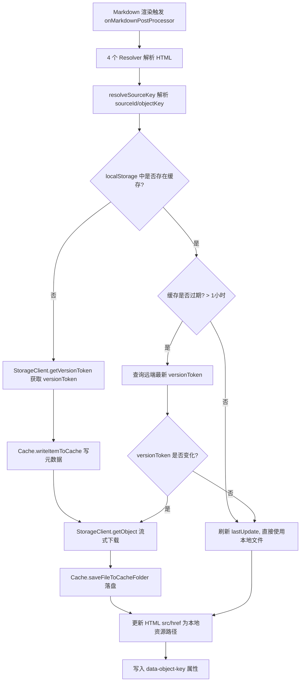
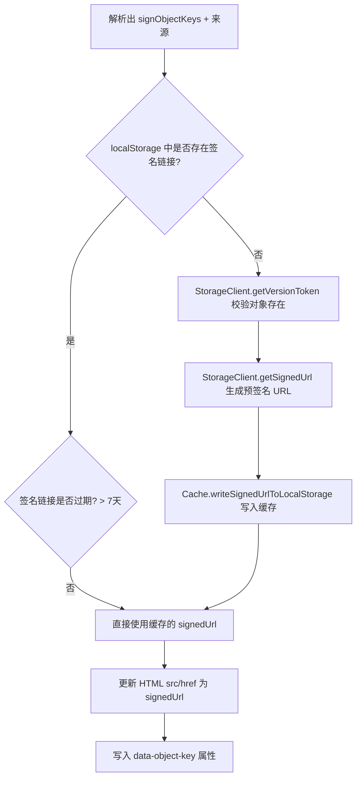
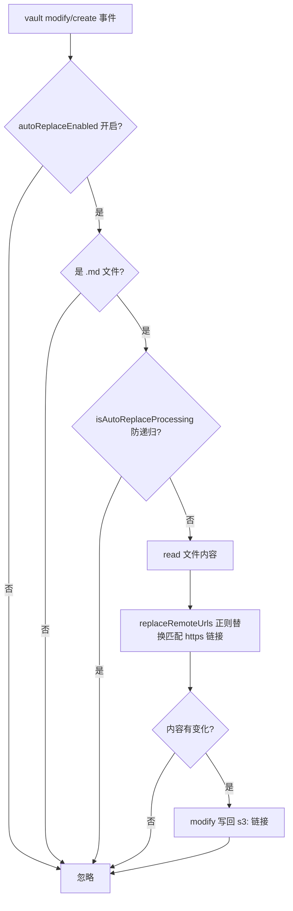
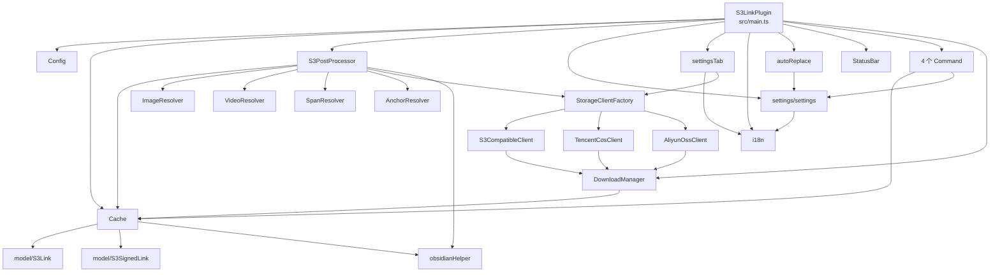

# obsidian-plugin-s3-link 架构文档

> 最后更新：2026-08-27
> 本文档基于对代码库的静态扫描自动生成，并随多对象存储支持、UI 增强与自动替换功能同步更新。

## 1. 项目概览

`obsidian-plugin-s3-link` 是一个 Obsidian 桌面端插件（`isDesktopOnly: true`），用于在笔记中引用对象存储中的文件。插件会把文件下载并缓存到本地 vault 的 `s3_cache` 文件夹，并支持生成预签名 URL。

- **已实现**：AWS S3、腾讯云 COS、阿里云 OSS、任意 S3 兼容端点（MinIO 等）
- **认证**：设置页文本输入 Access Key / Secret Key（不再读取 `~/.aws/credentials`）
- **UI**：Provider 下拉；已知服务商端点按 Region 自动组合；测试连接；中/英文界面
- **自动替换**：可选监听文档变化，将匹配存储源的 `https://` 链接自动替换为 `s3:` 格式

支持的链接语法：

| 语法 | 行为 |
| --- | --- |
| `s3:[objectKey]` | 下载并缓存文件到本地，周期性检查远端是否有新版本 |
| `s3:[sourceName/objectKey]` | 指定存储源（多源场景，可选前缀） |
| `s3-sign:[objectKey]` / `s3-sign:[sourceName/objectKey]` | 生成预签名 URL（7 天有效，自动续签） |

支持的 HTML 元素：图片 `img`、视频 `video`、内嵌 span（PDF/音频）、锚点 `a`。

## 2. 技术栈

- TypeScript 4.7；esbuild（CJS，`src/main.ts` → `main.js`）
- Jest + ts-jest + jest-environment-jsdom（`test/mock/obsidianMock.ts`）
- 存储 SDK：`@aws-sdk/client-s3`、`@aws-sdk/s3-request-presigner`、`cos-nodejs-sdk-v5`、`ali-oss`
- Obsidian API：`Plugin`、`PluginSettingTab`、`Notice`、`TFile`、`TAbstractFile`、`FileSystemAdapter`、`Vault` 事件

## 3. 目录结构

```
src/
├── main.ts                  # 插件入口（设置迁移、语言、vault 监听/自动替换）
├── config.ts                # 全局常量（前缀、PROVIDERS、缓存模式版本等）
├── i18n.ts                  # 多语言（en/zh），setLanguage / t(key)
├── autoReplace.ts           # https:// → s3: 链接自动替换（正则 + 围栏感知）
├── cache.ts                 # 本地缓存（文件系统 + localStorage 元数据）
├── s3PostProcessor.ts       # Markdown 后处理器（多源编排核心）
├── obsidianHelper.ts        # 资源路径辅助（getCacheFileName sha1、getVaultResourcePath）
├── pluginState.ts           # 插件状态枚举
├── command/                 # 4 个命令（清缓存/重载叶子）
├── model/                   # S3Link（versionToken/sourceId）、S3SignedLink
├── network/                 # StorageClient + 3 适配器 + 工厂 + DownloadManager
├── resolver/                # img/video/span/anchor 四类解析器
├── settings/                # StorageSource 模型 + settingsTab（下拉/自动端点/测试连接/语言/自动替换开关）
└── ui/                      # notification、statusBar
```

> `src/aws/` 目录已下线。

## 4. 核心模块说明

### 4.1 入口：`S3LinkPlugin`（`src/main.ts`）

- `onload`：状态栏 → 加载设置（含迁移）→ 设置页 → `Cache` → 清理下载 → 后处理器 → 命令 → `registerVaultListeners` → 状态。
- `registerVaultListeners`：`vault.on("modify"/"create")` → `onFileModified`。
- `onFileModified`：`autoReplaceEnabled` 开启时，对 `.md` 文件 `read` → `replaceRemoteUrls` → 若有变化 `modify`；`isAutoReplaceProcessing` 防递归。

### 4.2 配置常量：`Config`（`src/config.ts`）

`CACHE_FOLDER`、`S3_LINK_PREFIX`(`s3`)、`S3_SIGNED_LINK_PREFIX`(`s3-sign`)、`SOURCE_SPLITTER`(`/`)、TTL 常量、`CACHE_SCHEMA_VERSION`(2)、`PROVIDERS`。

### 4.3 编排核心：`S3PostProcessor`（`src/s3PostProcessor.ts`）

4 个 Resolver 解析 HTML → `resolveSourceKey` 解析 `{sourceId, objectKey}` → 从 `clients` Map 取 `StorageClient` 处理。使用统一 `versionToken`。

### 4.4 解析器族：`Resolver`（`src/resolver/`）

`img` / `video` / `span` / `a` 四类；提取原始键；`split(":")` 解析（含冒号截断局限）。

### 4.5 缓存：`Cache`（`src/cache.ts`）

文件系统 `s3_cache/`（`sha1(versionToken)+ext`）+ localStorage（含 sourceId 键）；`CACHE_SCHEMA_VERSION` 升级自动清缓存。

### 4.6 网络层：`StorageClient` 适配器体系（`src/network/`）

```ts
interface StorageClient {
    getVersionToken(objectKey: string): Promise<string | undefined>;
    getObject(objectKey: string, versionToken: string): Promise<Readable>;
    getSignedUrl(objectKey: string): Promise<string>;
    testConnection(): Promise<void>;
}
```

| 适配器 | 版本标识 | 签名 URL | 测试连接 |
| --- | --- | --- | --- |
| `S3CompatibleClient` | `VersionId` | presigner | ListObjectsV2 |
| `TencentCosClient` | `ETag` | `cos.getObjectUrl` | `cos.getBucket` |
| `AliyunOssClient` | `etag` | `client.signatureUrl` | `client.list` |

`StorageClientFactory.create(source)` 按 provider 分发；`DownloadManager` 管理下载状态机。

### 4.7 AWS 凭证（已下线）

### 4.8 命令（`src/command/`）

`ClearCacheGlobal` / `ClearCacheLocal`（多源解析）/ `ReloadActiveLeaf` / `ReloadAllLeafs`。

### 4.9 设置（`src/settings/`）

- `StorageSource` + `PluginSettings{sources, language, autoReplaceEnabled}`。
- `getComposedEndpoint` / `isKnownProvider` / `resolveSourceKey` / `isPluginReadyState`。
- `PluginSettingsTab`：语言下拉、自动替换开关、Provider 下拉、已知服务商端点自动组合（不显示输入框）、S3 兼容自定义端点、测试连接、添加/删除源。

### 4.10 UI（`src/ui/`）

`sendNotification`（Notice）、`StatusBar`。

### 4.11 辅助与国际化

`obsidianHelper.ts`（`getCacheFileName`、`getVaultResourcePath`）、`i18n.ts`。

### 4.12 自动替换远程链接（`src/autoReplace.ts`）

- 为每个源构建主机后缀规则：
  - 腾讯 COS：`cos.<region>.myqcloud.com`
  - 阿里 OSS：`oss-<region>.aliyuncs.com`、`oss.aliyuncs.com`
  - AWS：`s3.<region>.amazonaws.com`、`s3-<region>.amazonaws.com`、`s3.amazonaws.com`
  - S3 兼容：端点主机名（`extractHost`）
- `replaceRemoteUrls(content, sources)`：正则匹配 `https?://`，支持虚拟主机（`https://<bucket>.<host>/<key>`）与路径（`https://<host>/<bucket>/<key>`）两种寻址，桶名匹配后提取 objectKey，替换为 `s3:<sourceName/objectKey>`（默认源无前缀）；fenced 代码块（```` ``` ````）不处理。
- 由 `main.ts` 的 vault 监听按需调用。

## 5. 核心流程

### 5.1 普通链接 `s3:` 处理流程



### 5.2 签名链接 `s3-sign:` 处理流程



### 5.3 自动替换流程



## 6. 数据存储汇总

| 存储位置 | 内容 | 键/路径格式 |
| --- | --- | --- |
| localStorage | 普通链接元数据 | `obsidian-plugin-s3-link/<sourceId>/<objectKey>` |
| localStorage | 签名链接元数据 | `obsidian-plugin-s3-link/<sourceId>/s3-sign/<objectKey>` |
| localStorage | 下载记录 | `obsidian-plugin-s3-link-manager/<sourceId>/<objectKey>/<versionToken>` |
| localStorage | 缓存模式版本 | `obsidian-plugin-s3-link-cache-schema-version` = `2` |
| 文件系统 | 缓存文件 | `<vault>/s3_cache/<sha1(versionToken)><extname>` |
| 文件系统 | 插件设置 | Obsidian `data.json`（`sources` + `language` + `autoReplaceEnabled`） |

## 7. 依赖关系图



## 8. 构建、测试与发布

- 开发 `npm run dev`；构建 `npm run build`（tsc + esbuild，`main.js` 约 4.4MB）；测试 Jest（7 套件 / 44 用例）；lint `npx eslint .`。
- 发布：推送 `v*` 标签触发 GitHub Actions 创建 Release（main.js / manifest.json / versions.json）。

## 9. 设计要点与已知局限

1. 多源 + 版本令牌；适配器隔离；端点自动组合；大文件流式；崩溃恢复。
2. **自动替换局限**：
  - 使用 `s3:` 格式（`s3://` 不被插件解析器识别）
  - fenced 代码块不处理；**行内代码（`code`）与 HTML 标签内 URL 未做保护**（可能被替换）
  - 仅处理 `.md` 文件；仅在文档 modify/create 时触发，不做全库批量替换
  - `modify` 写回可能影响正在编辑该文件的游标位置
3. 其他已知问题：`split(":")` 冒号截断；`forEach(async)` 未串行等待；COS/OSS 适配器需真桶联调；i18n 暂仅覆盖设置 UI。

## 10. 已实现的决策（2026-08-27）

多对象存储支持、UI 增强与自动替换功能已按决策文件（含 §7 修订）实现并落地，本文档已同步更新。
