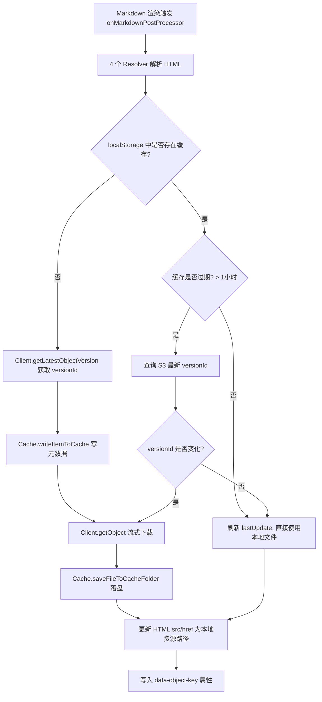
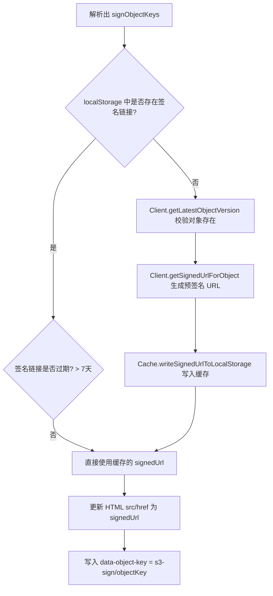
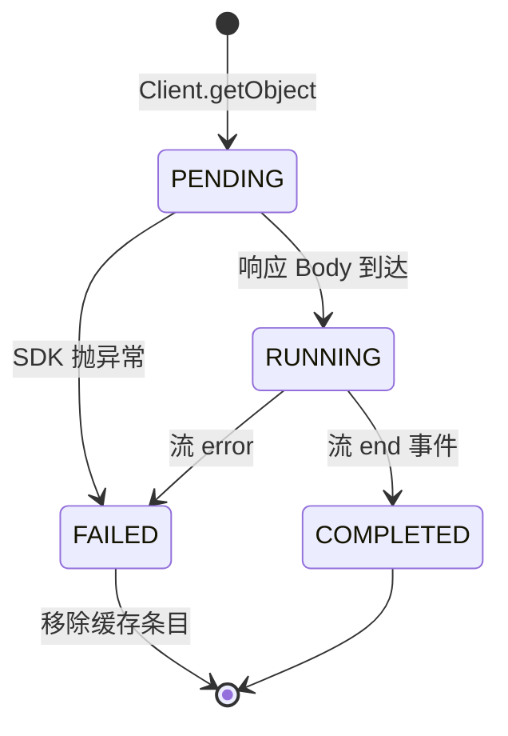
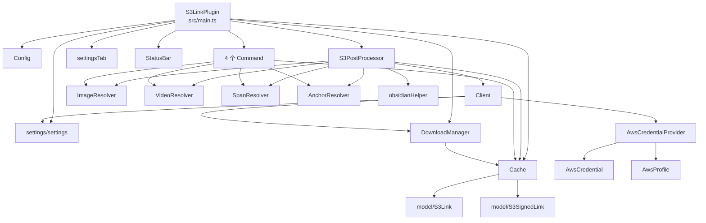

# obsidian-plugin-s3-link 架构文档

> 最后更新：2026-08-27
> 本文档基于对代码库的静态扫描自动生成，描述了插件的整体架构、核心模块、数据流与关键流程。

## 1. 项目概览

`obsidian-plugin-s3-link` 是一个 Obsidian 桌面端插件（`isDesktopOnly: true`），用于在笔记中引用 AWS S3 中的对象。插件会把 S3 对象下载并缓存到本地 vault 的 `s3_cache` 文件夹中，并支持通过 AWS IAM 凭证（`~/.aws/credentials` 配置文件或直接填写 Access Key）进行身份认证。

支持的链接语法：

| 语法                    | 行为                                 |
| --------------------- | ---------------------------------- |
| `s3:[objectKey]`      | 下载并缓存文件到本地，周期性检查 S3 上是否有新版本，有则重新下载 |
| `s3-sign:[objectKey]` | 生成预签名 URL（7 天有效），过期后自动续签，不下载文件     |


支持的 HTML 元素：图片 `img`、视频 `video`、内嵌 span（PDF/音频）、锚点 `a`。

## 2. 技术栈

- **语言**：TypeScript 4.7
- **打包**：esbuild（CJS 格式，入口 `src/main.ts`，输出 `main.js`）
- **测试**：Jest + ts-jest，环境 `jest-environment-jsdom`（模拟 Obsidian 的浏览器环境）
- **AWS SDK**：
  - `@aws-sdk/client-s3` — S3 客户端（`ListObjectVersions`、`GetObject`）
  - `@aws-sdk/s3-request-presigner` — 生成预签名 URL
- **Obsidian API**：`Plugin`、`PluginSettingTab`、`Notice`、`TFile`、`FileSystemAdapter` 等

## 3. 目录结构

```
src/
├── main.ts                  # 插件入口（S3LinkPlugin）
├── config.ts                # 全局常量（前缀、缓存目录、过期时间等）
├── cache.ts                 # 本地缓存（文件系统 + localStorage 元数据）
├── s3PostProcessor.ts       # Markdown 后处理器（核心编排逻辑）
├── obsidianHelper.ts        # 获取 vault 内资源路径的辅助函数
├── pluginState.ts           # 插件状态枚举
├── aws/
│   ├── awsCredential.ts          # AWS 凭证模型
│   ├── awsCredentialProvider.ts  # 读取/解析 ~/.aws/credentials
│   └── awsProfile.ts             # AWS Profile 模型
├── command/
│   ├── command.ts                # 命令抽象基类
│   ├── clearCacheGlobalCommand.ts    # 清空全局缓存
│   ├── clearCacheLocalCommand.ts     # 清空当前叶子视图的缓存
│   ├── reloadActiveLeafCommand.ts    # 重载当前预览叶子
│   └── reloadAllLeafsCommand.ts      # 重载所有预览叶子
├── model/
│   ├── s3Link.ts              # 普通 S3 链接元数据（objectKey/lastUpdate/versionId）
│   └── s3SignedLink.ts        # 签名链接元数据（objectKey/lastUpdate/signedUrl）
├── network/
│   ├── client.ts              # AWS S3 客户端封装（单例 s3Client）
│   ├── downloadManager.ts     # 下载生命周期管理（单例）
│   ├── downloadRecord.ts      # 下载记录类型
│   └── downloadState.ts       # 下载状态枚举
├── resolver/
│   ├── resolver.ts            # 解析器抽象基类
│   ├── imageResolver.ts       #  元素解析
│   ├── videoResolver.ts       # <video> 元素解析
│   ├── spanResolver.ts        # <span> 元素解析（PDF/音频嵌入）
│   └── anchorResolver.ts      # <a> 元素解析
├── settings/
│   ├── settings.ts            # PluginSettings 接口、默认值、区域列表、就绪校验
│   └── settingsTab.ts         # 设置页 UI
└── ui/
    ├── notification.ts        # Notice 通知封装
    └── statusBar.ts           # 状态栏指示器
```

## 4. 核心模块说明

### 4.1 入口：`S3LinkPlugin`（`src/main.ts`）

插件生命周期核心：

- **`onload`**：初始化状态栏 → 加载设置 → 注册设置页 → 初始化 `Cache` → 清理未完成的下载（`DownloadManager.cleanUnfinishedDownloads`）→ 注册 Markdown 后处理器 → 注册 4 个命令 → 根据设置完整性设置状态为 `READY` 或 `CONFIG`。
- **`onunload`**：关闭所有打开的写入流。
- **`setState`**：切换 `PluginState`（`LOADING` / `READY` / `CONFIG` / `ERROR`），同步更新状态栏图标与文案；进入 `CONFIG` 时弹出通知。
- **`saveSettings`**：持久化设置，重新校验状态，并通知 `S3PostProcessor` 重新初始化 S3 客户端。

### 4.2 配置常量：`Config`（`src/config.ts`）

集中管理所有魔法值：

| 常量                                       | 值                       | 用途                    |
| ---------------------------------------- | ----------------------- | --------------------- |
| `CACHE_FOLDER`                           | `s3_cache`              | vault 根目录下的缓存文件夹      |
| `S3_LINK_PREFIX`                         | `s3`                    | 普通链接前缀                |
| `S3_SIGNED_LINK_PREFIX`                  | `s3-sign`               | 签名链接前缀                |
| `S3_LINK_EXPIRATION_TIME_SECONDS`        | 3600（1 小时）              | 普通链接缓存过期时间            |
| `S3_SIGNED_LINK_EXPIRATION_TIME_SECONDS` | 604800（7 天）             | 签名 URL 过期时间           |
| `OBSIDIAN_APP_LINK_PREFIX`               | `obsidian://open?file=` | 锚点链接在 Obsidian 内打开的前缀 |
| `S3_LINK_PLUGIN_DATA_ATTRIBUTE`          | `data-object-key`       | 处理后写入 HTML 元素的标记属性    |


### 4.3 编排核心：`S3PostProcessor`（`src/s3PostProcessor.ts`）

插件的"大脑"，作为 `registerMarkdownPostProcessor` 的回调被 Obsidian 在预览渲染时调用：

- **`onMarkdownPostProcessor(element)`**：依次用 4 个 Resolver 解析渲染后的 HTML 元素，将结果合并为 `objectKeys`（普通链接）与 `signObjectKeys`（签名链接）两张 `Map<objectKey, HTMLElement[]>`，分别交给 `processS3Links` 和 `processS3SignLinks`。
- **`processS3Links`**：普通链接处理流程（见 §5.1）。
- **`processS3SignLinks`**：签名链接处理流程（见 §5.2）。
- **`updateLinkReferences`**：按元素类型（`HTMLImageElement` / `HTMLVideoElement` / `HTMLSpanElement` / `HTMLAnchorElement`）更新 `src`/`href` 为本地资源路径，并写入 `data-object-key` 属性供后续命令识别。
- **`onSettingsChanged`**：设置变更时重新初始化 S3 客户端。

### 4.4 解析器族：`Resolver`（`src/resolver/`）

抽象基类 `Resolver` 提供共享的 `objectKeys` / `signObjectKeys` Map 及增删逻辑，声明抽象方法：

- `resolveHtmlElement(element)`：从渲染的 HTML 中按 `s3:` / `s3-sign:` 前缀拆分 `src`/`href`，提取 objectKey。
- `findAllObjectKeysInElement(element)`：通过 `data-object-key` 属性反查当前视图中已处理的 objectKey（供"清除当前叶子缓存"命令使用）。

四个子类对应四种元素类型：

| Resolver         | 目标元素        | 说明                                               |
| ---------------- | ----------- | ------------------------------------------------ |
| `ImageResolver`  | `img`       | 支持普通与签名链接                                        |
| `VideoResolver`  | `video`     | 支持普通与签名链接（签名视频嵌入不受支持时警告）                         |
| `SpanResolver`   | `span[src]` | 仅支持普通链接；Obsidian 用 span 渲染 PDF/音频嵌入，签名 URL 明确不支持 |
| `AnchorResolver` | `a`         | 支持普通与签名链接                                        |


> 注意：`split(":")` 方式解析链接，若 objectKey 本身含 `:` 会截断（设计局限）。

### 4.5 缓存：`Cache`（`src/cache.ts`）

双层缓存结构：

1. **文件系统缓存**：vault 根目录下的 `s3_cache/` 文件夹，文件名格式为 `<versionId><extname>`（以 S3 版本 ID 作为文件名实现版本隔离）。
2. **元数据缓存（localStorage）**：序列化 `S3Link` / `S3SignedLink` JSON，键名格式：
  - 普通链接：`obsidian-plugin-s3-link/<objectKey>`
  - 签名链接：`obsidian-plugin-s3-link/s3-sign/<objectKey>`

主要职责：

- `init`：确保缓存文件夹存在（不存在则通过 `app.vault.createFolder` 创建）。
- `saveFileToCacheFolder`：以流式（`Readable.pipe(writeStream)`）方式落盘，支持大文件；已存在时直接返回 `TFile`。所有打开的流登记在 `openStreams`，插件卸载时统一 `destroy`。
- `findItemInCache` / `findSignedUrlInCache`：从 localStorage 读取；签名链接读取时若已过期则删除并返回 `null`。
- `isS3LinkCacheItemExpired` / `isS3SignedLinkCacheItemExpired`：基于 `lastUpdate` 与各自 TTL 判断过期。
- `clearCache`：清空缓存文件夹 + 清空所有插件相关 localStorage 键。
- `removeItemFromCache`：先删文件（依赖 localStorage 中的 versionId 定位文件名），后删 localStorage 条目。

### 4.6 网络层（`src/network/`）

#### `Client`（`client.ts`）

封装 AWS SDK 的 S3 操作，持有唯一的 `S3Client` 实例：

- `initializeS3Client(settings)` / `createS3Client()`：
  - 使用 profile 时通过 `AwsCredentialProvider` 读取凭证；凭证缺失则将状态置为 `ERROR` 并清空 profile。
  - 否则使用直接填写的 Access Key / Secret Key。
- `getLatestObjectVersion(objectKey)`：调用 `ListObjectVersionsCommand`，过滤 `Key === objectKey` 的版本并返回最新 `VersionId`（版本列表第一个）。
- `getObject(objectKey, versionId)`：通过 `DownloadManager` 登记下载，调用 `GetObjectCommand`，将浏览器 `ReadableStream` 转换为 Node.js `Readable`（`browserStreamToReadable`），流结束时标记下载完成。
- `getSignedUrlForObject(objectKey)`：使用 `getSignedUrl`（`@aws-sdk/s3-request-presigner`）生成 7 天有效的预签名 URL。

#### `DownloadManager`（`downloadManager.ts`，单例）

管理每个下载任务的生命周期状态（`DownloadState`：`PENDING → RUNNING → COMPLETED / FAILED`），记录持久化在 localStorage，键格式：

```
obsidian-plugin-s3-link-manager/<objectKey>/<versionId>
```

- `addNewDownload` / `setRunningState` / `setCompletedState` / `setErrorState`：流转状态；失败时同时从缓存中移除该条目。
- `cleanUnfinishedDownloads`：插件启动时清理所有非 `COMPLETED` 状态的下载记录及其缓存，避免断电/崩溃导致的脏数据。

### 4.7 AWS 凭证（`src/aws/`）

- `AwsProfile`：简单值对象（`name`）。
- `AwsCredential`：值对象（`profileName` / `accessKeyId` / `secretAccessKey`）。
- `AwsCredentialProvider`：
  - 定位 `os.homedir()/.aws/credentials` 文件。
  - `parseIni`：手写 INI 解析器（按 `[section]` 与 `key=value` 解析）。
  - `getAwsProfiles`：返回 profile 列表（首项固定为 `None`）。
  - `getAwsCredentials(profileName)`：按名称匹配返回凭证。

### 4.8 命令（`src/command/`）

`Command` 抽象基类声明 `moduleName` / `commandId` / `commandName` 与 `addCommand(plugin)`，四个实现：

| 命令                        | 行为                                                                                                                            |
| ------------------------- | ----------------------------------------------------------------------------------------------------------------------------- |
| `ClearCacheGlobalCommand` | 调用 `cache.clearCache()` 清空全部缓存                                                                                                |
| `ClearCacheLocalCommand`  | 用 4 个 Resolver 的 `findAllObjectKeysInElement` 收集当前 Markdown 视图中的 objectKey，逐个 `removeItemFromCache`（仅当活动叶子是 MarkdownView 时可见） |
| `ReloadActiveLeafCommand` | 对预览模式的活动叶子调用 `leaf.rebuildView()` 强制重渲染                                                                                       |
| `ReloadAllLeafsCommand`   | 遍历所有预览模式的 Markdown 叶子并重渲染                                                                                                     |


### 4.9 设置（`src/settings/`）

- `PluginSettings`：`bucketName` / `region` / `accessKeyId` / `secretAccessKey` / `profile`。
- `isPluginReadyState`：校验 bucket 名、区域、以及凭证（profile 或 accessKey + secretKey 二者至少一种）是否齐全。
- `PluginSettingsTab`：设置页 UI，包含桶名、区域下拉（内置 AWS 区域表）、AWS Profile 下拉（从凭证文件动态读取）及 Access Key 输入框；选择 profile 后禁用 Access Key 输入。

### 4.10 UI（`src/ui/`）

- `sendNotification`：包装 Obsidian `Notice`，统一加插件名前缀。
- `StatusBar`：状态栏指示器，根据 `PluginState` 显示不同图标与文案；点击 `CONFIG` 状态时直接打开插件设置页。

### 4.11 辅助函数：`obsidianHelper.ts`

- `getVaultResourcePath(arg: S3Link | TFile)`：将 `S3Link`（按 `versionId+ext` 拼路径）或 `TFile` 转换为 Obsidian 的 `app.vault.getResourcePath` 资源 URL。
- `getAbstractFileWithRetry`：由于文件采用流式写入（非 `writeBinary`），新文件不会立即出现在 vault 索引中，因此以 10 次、100ms 间隔轮询重试获取 `TFile`。

## 5. 核心流程

### 5.1 普通链接 `s3:` 处理流程



### 5.2 签名链接 `s3-sign:` 处理流程



### 5.3 下载生命周期



## 6. 数据存储汇总

| 存储位置         | 内容         | 键/路径格式                                                                               |
| ------------ | ---------- | ------------------------------------------------------------------------------------ |
| localStorage | 普通链接元数据    | `obsidian-plugin-s3-link/<objectKey>` → `{objectKey, lastUpdate, versionId}`         |
| localStorage | 签名链接元数据    | `obsidian-plugin-s3-link/s3-sign/<objectKey>` → `{objectKey, lastUpdate, signedUrl}` |
| localStorage | 下载记录       | `obsidian-plugin-s3-link-manager/<objectKey>/<versionId>` → `DownloadRecord`         |
| 文件系统         | 缓存文件       | `<vault>/s3_cache/<versionId><extname>`                                              |
| 文件系统         | 插件设置       | Obsidian `data.json`（经 `loadData` / `saveData`）                                      |
| 文件系统         | AWS 凭证（只读） | `~/.aws/credentials`                                                                 |


## 7. 依赖关系图



## 8. 构建、测试与发布

- **开发**：`npm run dev` — esbuild watch 模式，改动后需在 Obsidian 中手动重载插件。
- **构建**：`npm run build` — 先 `tsc -noEmit -skipLibCheck` 类型检查，再 esbuild 生产打包（含 tree shaking，输出 `main.js`）。
- **测试**：`npm run lint` + Jest（`test/` 目录，覆盖 `anchorResolver` / `cache` / `downloadManager` / `imageResolver` / `spanResolver` / `videoResolver`，`test/mock/localStorageMock.ts` 提供 localStorage 模拟）。
- **发布**：推送 `vx.x.x` 标签触发 GitHub Actions（`.github/workflows/release.yaml`）自动创建 Release。

## 9. 设计要点与已知局限

1. **版本化缓存**：以 S3 `versionId` 作为本地文件名，天然支持对象多版本共存与失效后重下；HTML 元素通过 `data-object-key` 属性关联回 objectKey，供"清除本地缓存"命令反查。
2. **大文件支持**：流式写入（`stream.pipe`）而非 `writeBinary`，代价是新文件无法立即被 vault 索引，需 `getAbstractFileWithRetry` 轮询补偿。
3. **崩溃恢复**：`DownloadManager` 在启动时清理未完成下载，避免半成品文件留在缓存。
4. **已知局限/潜在问题**：
  - `Client.getLatestObjectVersion` 只取版本列表第一个（最新），未使用 `DeleteMarkers` 处理已删除的对象。
  - Resolver 用 `split(":")` 解析链接，objectKey 包含冒号时会被错误截断。
  - `Cache.clearCache` / `removeItemFromCache` 只删除插件前缀的 localStorage 键；`removeItemFromLocalStorage` 中签名链接分支只有日志、未执行 `removeItem`（疑似 bug）。
  - `S3PostProcessor.updateLinkReferences` 的 `forEach(async ...)` 回调中 `await` 不会被正确串行等待。
  - 命令层对 `rebuildView` / `app.setting.open` 使用了 `@ts-ignore`，依赖未公开的 Obsidian 内部 API。
  - `ClearCacheLocalCommand` 存在 TODO：编辑模式（源码视图）下的链接尚未支持。
  - 普通链接每次打开笔记都会写一次 localStorage 刷新 `lastUpdate`，存在频繁序列化开销。
