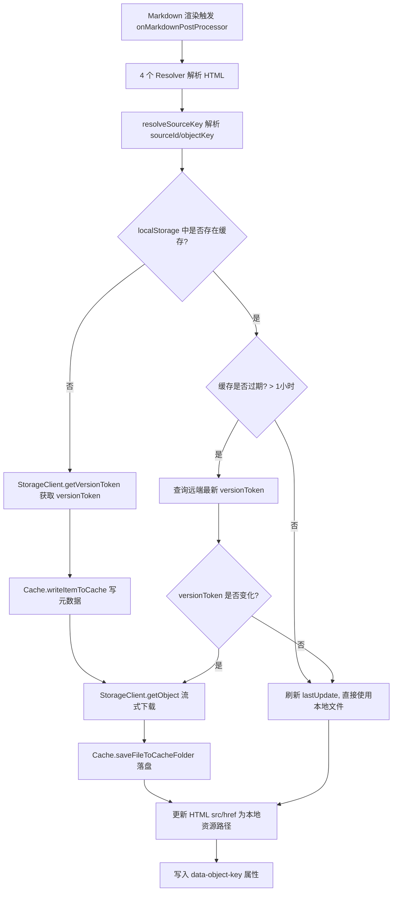
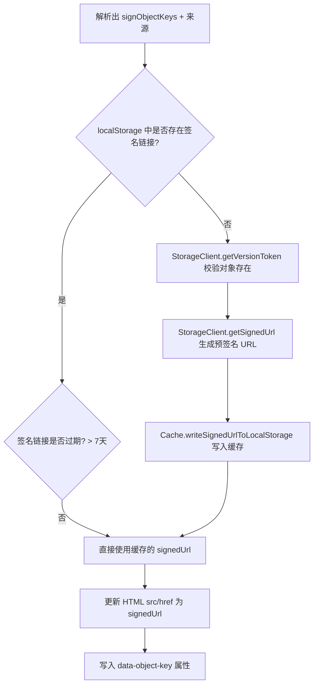
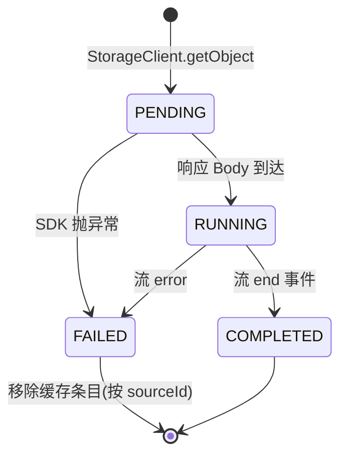
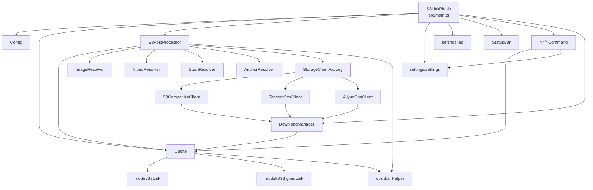

# obsidian-plugin-s3-link 架构文档

> 最后更新：2026-08-27
> 本文档基于对代码库的静态扫描自动生成，并随多对象存储支持实现同步更新，描述了插件的整体架构、核心模块、数据流与关键流程。

## 1. 项目概览

`obsidian-plugin-s3-link` 是一个 Obsidian 桌面端插件（`isDesktopOnly: true`），用于在笔记中引用对象存储中的文件。插件会把文件下载并缓存到本地 vault 的 `s3_cache` 文件夹，并支持生成预签名 URL。

- **已实现**：AWS S3、腾讯云 COS、阿里云 OSS、任意 S3 兼容端点（MinIO 等）
- **认证**：全部通过设置中的文本输入（Access Key ID / Secret Access Key），不再读取 `~/.aws/credentials`

支持的链接语法：

| 语法 | 行为 |
| --- | --- |
| `s3:[objectKey]` | 下载并缓存文件到本地，周期性检查远端是否有新版本，有则重新下载 |
| `s3:[sourceName/objectKey]` | 指定存储源（多源场景，可选前缀） |
| `s3-sign:[objectKey]` / `s3-sign:[sourceName/objectKey]` | 生成预签名 URL（7 天有效，自动续签），不下载文件 |

支持的 HTML 元素：图片 `img`、视频 `video`、内嵌 span（PDF/音频）、锚点 `a`。

## 2. 技术栈

- **语言**：TypeScript 4.7
- **打包**：esbuild（CJS 格式，入口 `src/main.ts`，输出 `main.js`）
- **测试**：Jest + ts-jest，环境 `jest-environment-jsdom`（`test/mock/obsidianMock.ts` 提供 obsidian 运行时 mock）
- **存储 SDK**：
  - `@aws-sdk/client-s3` + `@aws-sdk/s3-request-presigner` — AWS / S3 兼容适配器
  - `cos-nodejs-sdk-v5` — 腾讯云 COS 适配器
  - `ali-oss` — 阿里云 OSS 适配器
- **Obsidian API**：`Plugin`、`PluginSettingTab`、`Notice`、`TFile`、`FileSystemAdapter` 等

## 3. 目录结构

```
src/
├── main.ts                  # 插件入口（S3LinkPlugin，含设置迁移）
├── config.ts                # 全局常量（前缀、PROVIDERS、缓存模式版本等）
├── cache.ts                 # 本地缓存（文件系统 + localStorage 元数据）
├── s3PostProcessor.ts       # Markdown 后处理器（多源编排核心）
├── obsidianHelper.ts        # 资源路径辅助（getCacheFileName sha1、getVaultResourcePath）
├── pluginState.ts           # 插件状态枚举
├── command/
│   ├── command.ts                # 命令抽象基类
│   ├── clearCacheGlobalCommand.ts    # 清空全局缓存
│   ├── clearCacheLocalCommand.ts     # 清空当前叶子视图的缓存（多源解析）
│   ├── reloadActiveLeafCommand.ts    # 重载当前预览叶子
│   └── reloadAllLeafsCommand.ts      # 重载所有预览叶子
├── model/
│   ├── s3Link.ts              # 缓存元数据（objectKey/lastUpdate/versionToken/sourceId）
│   └── s3SignedLink.ts        # 签名链接元数据（objectKey/lastUpdate/signedUrl）
├── network/
│   ├── storageClient.ts           # StorageClient 统一接口
│   ├── storageClientFactory.ts    # 按 provider 创建适配器
│   ├── s3CompatibleClient.ts      # AWS / S3 兼容适配器（AWS SDK v3）
│   ├── tencentCosClient.ts        # 腾讯云 COS 适配器
│   ├── aliyunOssClient.ts         # 阿里云 OSS 适配器
│   ├── downloadManager.ts         # 下载生命周期管理（单例）
│   ├── downloadRecord.ts          # 下载记录类型
│   └── downloadState.ts           # 下载状态枚举
├── resolver/
│   ├── resolver.ts            # 解析器抽象基类
│   ├── imageResolver.ts       #  元素解析
│   ├── videoResolver.ts       # <video> 元素解析
│   ├── spanResolver.ts        # <span> 元素解析（PDF/音频嵌入）
│   └── anchorResolver.ts      # <a> 元素解析
├── settings/
│   ├── settings.ts            # StorageSource 模型、迁移、resolveSourceKey、就绪校验
│   └── settingsTab.ts         # 设置页 UI（全文本输入）
└── ui/
    ├── notification.ts        # Notice 通知封装
    └── statusBar.ts           # 状态栏指示器
```

> `src/aws/` 目录已下线（不再读取 `~/.aws/credentials`）。

## 4. 核心模块说明

### 4.1 入口：`S3LinkPlugin`（`src/main.ts`）

插件生命周期核心：

- **`onload`**：初始化状态栏 → 加载设置（含 v1→v2 迁移）→ 注册设置页 → 初始化 `Cache` → 清理未完成的下载 → 注册 Markdown 后处理器 → 注册 4 个命令 → 根据设置完整性设置状态为 `READY` 或 `CONFIG`。
- **`loadSettings`**：检测旧版扁平设置（存在顶层 `bucketName`），通过 `migrateLegacySettings` 迁移为 `StorageSource[]`；保证至少存在一个默认源。
- **`onunload`**：关闭所有打开的写入流。
- **`setState`**：切换 `PluginState` 并同步状态栏。

### 4.2 配置常量：`Config`（`src/config.ts`）

| 常量 | 值 | 用途 |
| --- | --- | --- |
| `CACHE_FOLDER` | `s3_cache` | 缓存文件夹 |
| `S3_LINK_PREFIX` / `S3_SIGNED_LINK_PREFIX` | `s3` / `s3-sign` | 链接前缀 |
| `SOURCE_SPLITTER` | `/` | 多源链接前缀分隔符 |
| `S3_LINK_EXPIRATION_TIME_SECONDS` | 3600 | 普通链接缓存过期时间 |
| `S3_SIGNED_LINK_EXPIRATION_TIME_SECONDS` | 604800（7 天） | 签名 URL 过期时间 |
| `CACHE_SCHEMA_VERSION` | 2 | 缓存模式版本（升级时自动清缓存） |
| `PROVIDERS` | `aws` / `tencent-cos` / `aliyun-oss` / `s3-compatible` | 支持厂商集合 |

### 4.3 编排核心：`S3PostProcessor`（`src/s3PostProcessor.ts`）

- **`onMarkdownPostProcessor(element)`**：4 个 Resolver 解析 HTML，合并为 `objectKeys` / `signObjectKeys`，分别交给 `processS3Links` / `processS3SignLinks`。
- **多源解析**：每个原始键经 `resolveSourceKey(settings, rawKey)` 解析为 `{sourceId, objectKey}`（支持 `sourceName/` 前缀，无前缀回退默认源），再从 `clients` Map 取对应 `StorageClient`。
- **`processS3Links`** / **`processS3SignLinks`**：缓存命中/过期/新对象处理，使用统一 `versionToken`。
- **`onSettingsChanged`**：设置变更时重建 `clients` Map。

### 4.4 解析器族：`Resolver`（`src/resolver/`）

抽象基类 `Resolver` 提供 `objectKeys` / `signObjectKeys` Map 与增删逻辑；四个子类对应 `img` / `video` / `span` / `a`。仅负责从渲染 HTML 提取原始键（可含 `sourceName/` 前缀），来源归属由 `S3PostProcessor` 处理。

> 注意：`split(":")` 解析链接，objectKey 本身含 `:` 会截断（设计局限）。

### 4.5 缓存：`Cache`（`src/cache.ts`）

双层缓存：

1. **文件系统**：`s3_cache/`，文件名 `<sha1(versionToken)><extname>`（ETag/VersionId 统一哈希，文件系统安全）。
2. **localStorage 元数据**：键格式（含 sourceId 维度）：
   - 普通：`obsidian-plugin-s3-link/<sourceId>/<objectKey>`
   - 签名：`obsidian-plugin-s3-link/<sourceId>/s3-sign/<objectKey>`

要点：

- `init` 时校验 `CACHE_SCHEMA_VERSION`，版本变化则自动 `clearCache()` 一次（升级清理）。
- `saveFileToCacheFolder` 流式落盘；`removeItemFromCache(sourceId, objectKey)` 同时清理普通与签名条目（修复了旧版签名键未删除的 bug）。

### 4.6 网络层：`StorageClient` 适配器体系（`src/network/`）

统一接口：

```ts
interface StorageClient {
    getVersionToken(objectKey: string): Promise<string | undefined>; // 最新版本标识
    getObject(objectKey: string, versionToken: string): Promise<Readable>; // 流式下载
    getSignedUrl(objectKey: string): Promise<string>; // 签名 URL
}
```

| 适配器 | 版本标识 | 签名 URL | 依赖 |
| --- | --- | --- | --- |
| `S3CompatibleClient` | `VersionId`（ListObjectVersions） | `getSignedUrl` presigner | `@aws-sdk/client-s3` |
| `TencentCosClient` | `ETag`（headObject） | `cos.getObjectUrl` | `cos-nodejs-sdk-v5` |
| `AliyunOssClient` | `ETag`（head） | `client.signatureUrl` | `ali-oss` |

- `StorageClientFactory.create(source)` 按 `source.provider` 返回适配器；`aws` 与 `s3-compatible` 共用 `S3CompatibleClient`（`endpoint` + `forcePathStyle` 区分）。
- `S3CompatibleClient` 支持自定义 `endpoint` 与 path-style 寻址（MinIO 等）。

#### `DownloadManager`（单例）

下载状态机 `PENDING → RUNNING → COMPLETED / FAILED`；记录键含 sourceId：
`obsidian-plugin-s3-link-manager/<sourceId>/<objectKey>/<versionToken>`。失败或启动清理时按 `sourceId` 移除缓存。

### 4.7 AWS 凭证（已下线）

`src/aws/`（`AwsCredentialProvider` / `AwsProfile` / `AwsCredential`）已从代码库移除；不再读取 `~/.aws/credentials`，凭证统一由设置页文本输入提供。

### 4.8 命令（`src/command/`）

| 命令 | 行为 |
| --- | --- |
| `ClearCacheGlobalCommand` | 调用 `cache.clearCache()` 清空全部缓存 |
| `ClearCacheLocalCommand` | 收集当前视图 `data-object-key`，经 `resolveSourceKey` 解析后逐个 `removeItemFromCache(sourceId, objectKey)` |
| `ReloadActiveLeafCommand` | 重渲染活动预览叶子 |
| `ReloadAllLeafsCommand` | 重渲染所有预览叶子 |

### 4.9 设置（`src/settings/`）

- `StorageSource`：`id` / `name` / `provider` / `endpoint` / `bucketName` / `region` / `accessKeyId` / `secretAccessKey` / `pathStyle` / `defaultSource` / `signLinkEnabled`。
- `PluginSettings`：`sources: StorageSource[]`（多源）。
- `resolveSourceKey`：解析 `sourceName/` 前缀归属。
- `isPluginReadyState`：按源校验桶名、endpoint/region、凭证。
- `PluginSettingsTab`：**全部文本输入**（无 AWS Region / Profile 下拉）；支持添加/删除存储源、默认源与签名链接开关。

### 4.10 UI（`src/ui/`）

- `sendNotification`：包装 `Notice`。
- `StatusBar`：按 `PluginState` 显示状态；`CONFIG` 状态点击打开设置页。

### 4.11 辅助函数：`obsidianHelper.ts`

- `getCacheFileName(objectKey, versionToken)`：`sha1(versionToken)+ext`，供缓存文件名与链接更新共用。
- `getVaultResourcePath(arg: S3Link | TFile)`：转为 vault 资源 URL，配合 `getAbstractFileWithRetry` 补偿流式写入的索引延迟。

## 5. 核心流程

### 5.1 普通链接 `s3:` 处理流程



### 5.2 签名链接 `s3-sign:` 处理流程



### 5.3 下载生命周期



## 6. 数据存储汇总

| 存储位置 | 内容 | 键/路径格式 |
| --- | --- | --- |
| localStorage | 普通链接元数据 | `obsidian-plugin-s3-link/<sourceId>/<objectKey>` → `{objectKey, lastUpdate, versionToken, sourceId}` |
| localStorage | 签名链接元数据 | `obsidian-plugin-s3-link/<sourceId>/s3-sign/<objectKey>` → `{objectKey, lastUpdate, signedUrl}` |
| localStorage | 下载记录 | `obsidian-plugin-s3-link-manager/<sourceId>/<objectKey>/<versionToken>` → `DownloadRecord` |
| localStorage | 缓存模式版本 | `obsidian-plugin-s3-link-cache-schema-version` = `2` |
| 文件系统 | 缓存文件 | `<vault>/s3_cache/<sha1(versionToken)><extname>` |
| 文件系统 | 插件设置 | Obsidian `data.json`（`sources: StorageSource[]`） |

## 7. 依赖关系图



## 8. 构建、测试与发布

- **开发**：`npm run dev` — esbuild watch。
- **构建**：`npm run build` — `tsc -noEmit -skipLibCheck` + esbuild 生产打包（`main.js` 约 4.4MB，含三个 SDK）。
- **测试**：Jest（6 套件 / 35 用例，覆盖 resolver / cache / downloadManager）；`test/mock/obsidianMock.ts` + `moduleNameMapper` 提供 obsidian 运行时 mock。
- **Lint**：`npx eslint .`。
- **发布**：推送 `vx.x.x` 标签触发 GitHub Actions 创建 Release。

## 9. 设计要点与已知局限

1. **多源 + 版本令牌**：`StorageSource[]` 支持同 vault 多云端；统一 `versionToken`（AWS VersionId / COS·OSS ETag）与 sha1 缓存文件名。
2. **适配器隔离**：`StorageClient` 接口解耦业务编排与厂商 SDK；新增厂商只需实现接口并注册工厂。
3. **大文件支持**：流式写入 + `getAbstractFileWithRetry` 补偿。
4. **崩溃恢复**：`DownloadManager` 启动清理未完成下载；`CACHE_SCHEMA_VERSION` 升级自动清缓存。
5. **已知局限/潜在问题**：
  - `S3CompatibleClient.getVersionToken` 只取版本列表第一个，未处理 `DeleteMarkers`。
  - Resolver 用 `split(":")` 解析，objectKey 含冒号会被截断。
  - `S3PostProcessor.updateLinkReferences` 的 `forEach(async ...)` 回调中 `await` 不会被串行等待（沿用旧逻辑）。
  - `TencentCosClient` / `AliyunOssClient` 依赖 `@ts-ignore` 与显式 `any`（SDK 无完整类型），运行时行为需在真实桶上验证。
  - COS/OSS 的签名 URL 有效期上限需实测（实现取 7 天，个别厂商可能更短）。
  - 多分片对象 ETag 带 `-N` 后缀，版本令牌比较仍可用但需注意。
  - 命令层 `rebuildView` / `app.setting.open` 依赖未公开 Obsidian API（`@ts-ignore`）。
  - `ClearCacheLocalCommand` 仅支持预览模式（编辑模式 TODO 保留）。

## 10. 已实现的决策（2026-08-27）

多对象存储支持（腾讯云 COS、阿里云 OSS、S3 兼容端点；设置 UI 全文本输入）已按
`decisions/2026-08-27-multi-cloud-storage-support.md` 实现并落地，本文档 §2/§3/§4.6/§4.7/§4.9/§5/§6/§7 已同步更新。
